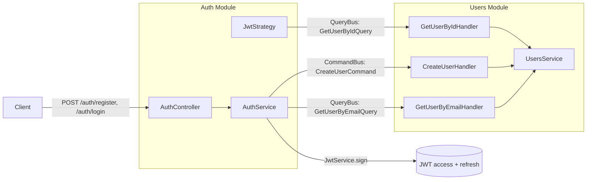

# JWT Authentication via CQRS

## Goal

Add real authentication to the API: `register` + `login` issuing JWT tokens, password
hashing with bcrypt, and a `JwtAuthGuard` protecting `expenses`/`categories`. The Auth and
Users modules interact **only through CQRS** (CommandBus/QueryBus) — no direct
`UsersService`/`UsersModule` import in Auth.

## CQRS interaction (no direct imports)

The Users module owns user data and registers CQRS handlers. The Auth module dispatches
commands/queries over the buses provided by `CqrsModule`. Neither module imports the other's
service or module — the only cross-module references are the command/query message classes,
which act as the contract; the bus resolves the handler at runtime.

## Task checklist

- [x] Add deps: `@nestjs/cqrs`, `@nestjs/jwt`, `@nestjs/passport`, `passport`,
      `passport-jwt`, `bcrypt` (+ `@types/passport-jwt`, `@types/bcrypt`).
- [x] `UsersService.create({ email, name, passwordHash })`.
- [x] Users CQRS: `CreateUserCommand` + handler, `GetUserByEmailQuery` + handler,
      `GetUserByIdQuery` + handler; register `CqrsModule` and handlers in `users.module.ts`.
- [x] Rework `auth.module.ts`: remove `UsersModule` import; add `CqrsModule`,
      `PassportModule`, `JwtModule.registerAsync`.
- [x] `AuthService.register`/`login` using `CommandBus`/`QueryBus` + bcrypt + `JwtService`
      issuing access/refresh tokens.
- [x] `JwtStrategy` (validate via `GetUserByIdQuery`), `JwtAuthGuard`, `@CurrentUser` decorator.
- [x] `POST /auth/register` and `POST /auth/login` endpoints.
- [x] Apply `JwtAuthGuard` + `@CurrentUser('userId')` to `expenses`/`categories` controllers,
      replacing the `?userId=` query.
- [x] Add `AuthResponse` type to the shared package and rebuild `dist`.
- [x] Add `JWT_REFRESH_EXPIRES_IN` to `apps/backend/.env.example`.
- [x] Update `CLAUDE.md` (JWT auth, CQRS cross-module pattern, new deps, env vars).
- [x] Build + lint backend; verify no direct `UsersService`/`UsersModule` import remains in `auth/`.

## Files

- `apps/backend/src/users/commands/create-user.command.ts` + `commands/handlers/create-user.handler.ts`
- `apps/backend/src/users/queries/get-user-by-email.query.ts` + `queries/handlers/get-user-by-email.handler.ts`
- `apps/backend/src/users/queries/get-user-by-id.query.ts` + `queries/handlers/get-user-by-id.handler.ts`
- `apps/backend/src/users/users.service.ts` (add `create`), `users.module.ts` (register CQRS + handlers)
- `apps/backend/src/auth/auth.service.ts`, `auth.controller.ts`, `auth.module.ts`
- `apps/backend/src/auth/jwt-payload.interface.ts`
- `apps/backend/src/auth/strategies/jwt.strategy.ts`
- `apps/backend/src/auth/guards/jwt-auth.guard.ts`
- `apps/backend/src/auth/decorators/current-user.decorator.ts`
- `apps/backend/src/expenses/expenses.controller.ts`, `apps/backend/src/categories/categories.controller.ts`
- `packages/shared/src/types/index.ts` (add `AuthResponse`)
- `apps/backend/.env.example` (add `JWT_REFRESH_EXPIRES_IN`)

## Verification

- `npm run build --workspace @expense-tracker/backend` and `npm run lint`.
- Manual: `POST /api/auth/register` -> `POST /api/auth/login` -> call `GET /api/expenses`
  with `Authorization: Bearer <accessToken>`.
- `grep` shows no `UsersService`/`UsersModule` import inside `apps/backend/src/auth/`.
