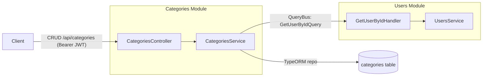

# Categories CRUD module

## Goal

Turn the categories module stub into a full JWT-protected CRUD: class-validator DTOs,
service methods (create / findAll / findOne / update / remove), CRUD controller endpoints,
and User-module interaction through the CQRS `QueryBus` (no direct `UsersService`/`UsersModule`
import).

## CQRS interaction with the User module

Category CRUD logic lives in `CategoriesService`. The only cross-module link is verifying the
owning user exists via the CQRS `QueryBus` (`GetUserByIdQuery`, registered by `UsersModule`),
so `categories` never imports `UsersService`/`UsersModule`.

## Design decisions

- Validation lives in backend DTO classes (class-validator); the global `ValidationPipe`
  (`whitelist`, `transform`) only validates classes, not the shared interfaces.
- `color` is optional (entity default `#7c3aed`), validated with `@IsHexColor()` when present.
  Shared `CreateCategoryDto.color` was made optional to match.
- `UpdateCategoryDto` is a plain class with all-optional validated fields (no `@nestjs/mapped-types`).
- Update via `PATCH /:id`; ownership enforced by scoping every read/update/delete on
  `{ id, userId }` (404 if not found).

## Task checklist

- [x] Add DTO classes with class-validator: `dto/create-category.dto.ts`, `dto/update-category.dto.ts`.
- [x] Extend `CategoriesService`: inject `QueryBus`; add `create` (verify user via
      `GetUserByIdQuery`), `findOne`, `update`, `remove`; keep `findAll`.
- [x] Add controller endpoints: `POST /`, `GET /`, `GET /:id`, `PATCH /:id`, `DELETE /:id` (204),
      all JWT-guarded via `@CurrentUser('userId')`.
- [x] Add `CqrsModule` to `categories.module.ts` imports.
- [x] Make `CreateCategoryDto.color` optional in `packages/shared` and rebuild shared `dist`.
- [x] Update `CLAUDE.md` (categories CRUD + QueryBus user-verification pattern).
- [x] Build + lint backend; confirm no `UsersService`/`UsersModule` import inside `categories/`.

## Files

- `apps/backend/src/categories/dto/create-category.dto.ts` (new)
- `apps/backend/src/categories/dto/update-category.dto.ts` (new)
- `apps/backend/src/categories/categories.service.ts` (create/findOne/update/remove + QueryBus)
- `apps/backend/src/categories/categories.controller.ts` (CRUD endpoints)
- `apps/backend/src/categories/categories.module.ts` (import `CqrsModule`)
- `packages/shared/src/dto/index.ts` (`CreateCategoryDto.color` optional)

## Endpoints (all under `/api`, JWT-guarded)

- `POST /categories` — create for current user
- `GET /categories` — list current user's categories
- `GET /categories/:id` — one owned category
- `PATCH /categories/:id` — update owned category
- `DELETE /categories/:id` — delete owned category (204)

## Verification

- `npm run build --workspace @expense-tracker/backend` and `npm run lint`.
- Manual: obtain a JWT via `POST /api/auth/login`, then exercise the CRUD endpoints with
  `Authorization: Bearer <accessToken>`.
