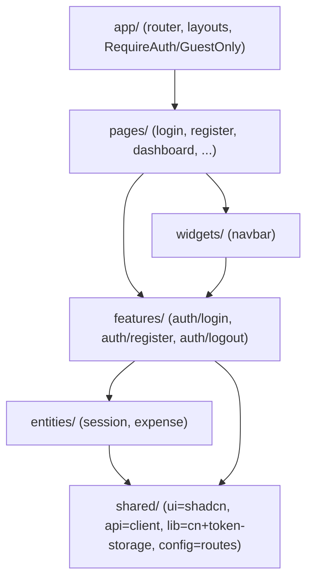

# Frontend Auth UI (shadcn/ui + Feature-Sliced Design)

## Goal

Implement the login and registration screens on top of the existing auth API
(`POST /api/auth/register`, `POST /api/auth/login` → `AuthResponse`). Use **shadcn/ui**
for the UI primitives and reorganise the whole frontend around **Feature-Sliced Design**
(FSD). Persist the session, attach the JWT to API calls, and guard routes.

## Architecture (FSD)

Layers import only **downward**: `app → pages → widgets → features → entities → shared`.
Each slice exposes a public `index.ts` barrel; cross-slice imports go through the barrel
(`@/<layer>/<slice>`), never deep paths or upward layers. The `@` alias maps to `src`
(tsconfig `paths` + Vite alias).

Key rule: `shared` must not import from `entities`. So `shared/api/client.ts` reads the
token from `shared/lib/token-storage`, which the `entities/session` store writes to.

## Task checklist

- [x] Add deps to `@expense-tracker/frontend`: `zustand`, `react-hook-form`,
      `@hookform/resolvers`, `zod`, `class-variance-authority`, `clsx`, `tailwind-merge`,
      `lucide-react`, `@radix-ui/react-slot`, `@radix-ui/react-label`, `tailwindcss-animate` (dev).
- [x] Set up shadcn/ui manually for Tailwind v3: `components.json`, CSS variables +
      `@layer base` in `src/app/styles/index.css`, tokens + `tailwindcss-animate` in
      `tailwind.config.ts`, `cn` helper. `--primary`/`--ring` track the violet `brand` (`#7c3aed`).
- [x] Add shadcn components under `shared/ui`: `button`, `input`, `label`, `card`, `form` (+ barrel).
- [x] Reorganise the frontend into FSD layers; delete the old flat
      `components/`, `router/`, `services/`, `store/`, `hooks/`, `lib/`, `types/` and `App.tsx`/`index.css`.
- [x] `shared/api/client.ts`: auth-aware `apiClient` (Bearer header from `tokenStorage`) +
      typed `ApiError` parsing the backend error `message` (joins `ValidationPipe` arrays).
- [x] `shared/lib/token-storage.ts` (localStorage tokens), `shared/config/routes.ts` (`ROUTES`).
- [x] `entities/session`: zustand store (`persist` user) with `setSession`/`clearSession`;
      `useSessionStore`, `useCurrentUser`, `useIsAuthenticated`.
- [x] `entities/expense`: move `expenseApi` + `useExpenses` hook.
- [x] `features/auth/login` + `features/auth/register`: zod schema, typed api call,
      react-hook-form form (shadcn `Form`), submit → `setSession` → navigate to `/`.
- [x] `features/auth/logout`: `LogoutButton` (clears session, navigates to `/login`).
- [x] `widgets/navbar`: shows user email + logout button.
- [x] `pages/login` + `pages/register` (shadcn `Card`, cross-links), plus migrated
      dashboard/expenses/categories/not-found pages.
- [x] `app/`: `router.tsx`, `layouts/AppLayout` (`<Outlet />`), `providers/RequireAuth`
      + `providers/GuestOnly` guards, `App` root, styles; update `main.tsx`.
- [x] Update `CLAUDE.md` (FSD architecture, frontend auth flow, layout, conventions).
- [x] Typecheck + lint + production build clean (only the two inherent shadcn
      `react-refresh/only-export-components` warnings on `button.tsx`/`form.tsx`).

## Files

- `apps/frontend/components.json`, `tailwind.config.ts`, `package.json` (deps)
- `apps/frontend/src/main.tsx`
- `apps/frontend/src/app/` — `App.tsx`, `index.ts`, `router.tsx`, `layouts/AppLayout.tsx`,
  `providers/RequireAuth.tsx`, `providers/GuestOnly.tsx`, `styles/index.css`
- `apps/frontend/src/pages/{login,register,dashboard,expenses,categories,not-found}/` (each `ui/*.tsx` + `index.ts`)
- `apps/frontend/src/widgets/navbar/` — `ui/Navbar.tsx`, `index.ts`
- `apps/frontend/src/features/auth/login/` — `ui/LoginForm.tsx`, `model/schema.ts`, `api/login.ts`, `index.ts`
- `apps/frontend/src/features/auth/register/` — `ui/RegisterForm.tsx`, `model/schema.ts`, `api/register.ts`, `index.ts`
- `apps/frontend/src/features/auth/logout/` — `ui/LogoutButton.tsx`, `index.ts`
- `apps/frontend/src/entities/session/` — `model/store.ts`, `index.ts`
- `apps/frontend/src/entities/expense/` — `api/expense.api.ts`, `model/use-expenses.ts`, `index.ts`
- `apps/frontend/src/shared/ui/` — `button.tsx`, `input.tsx`, `label.tsx`, `card.tsx`, `form.tsx`, `index.ts`
- `apps/frontend/src/shared/api/` — `client.ts`, `index.ts`
- `apps/frontend/src/shared/lib/` — `cn.ts`, `token-storage.ts`
- `apps/frontend/src/shared/config/routes.ts`
- Removed: `src/App.tsx`, `src/index.css`, `src/app/AppLayout.tsx`, `src/components/`,
  `src/router/`, `src/services/`, `src/store/`, `src/hooks/`, `src/types/`, old flat `src/pages/*.tsx`

## Verification

- `npm run typecheck --workspace @expense-tracker/frontend`
- `npm run lint --workspace @expense-tracker/frontend` (0 errors)
- `npm run build --workspace @expense-tracker/frontend`
- Manual: start backend + `npm run dev:frontend`, register a user → redirect to `/`,
  reload (session persists), logout → redirect to `/login`, visiting `/` while
  anonymous redirects to `/login`.

## Follow-ups (not done here)

- No `GET /auth/me` re-validation on load or token-refresh flow (backend endpoints missing) —
  session trusts persisted localStorage state.
- `apiClient` does not auto-logout / redirect on `401`.
